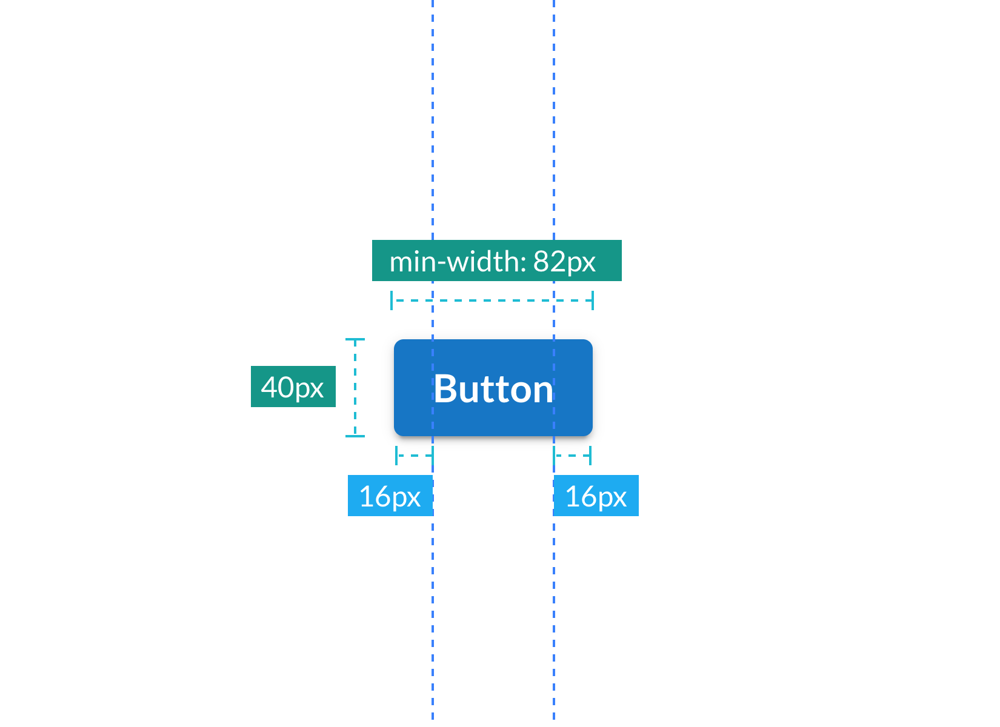
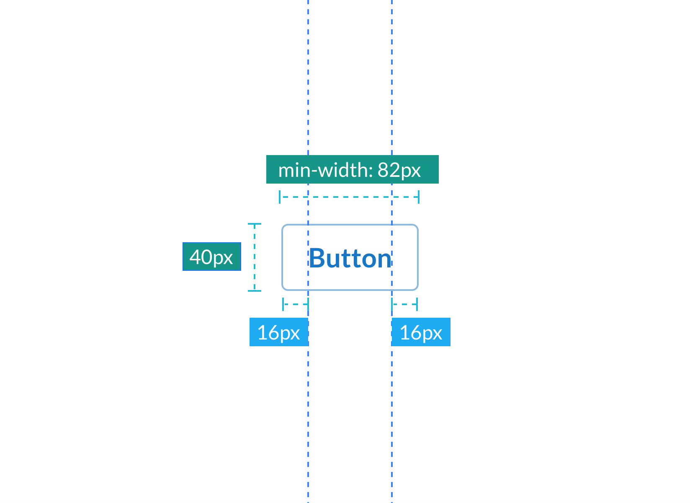
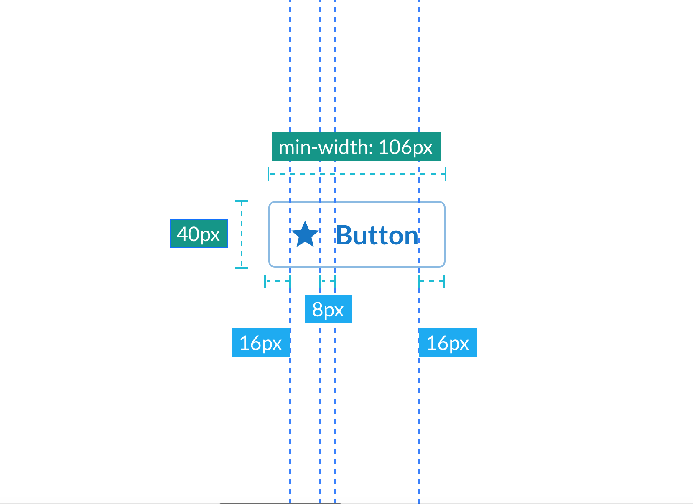
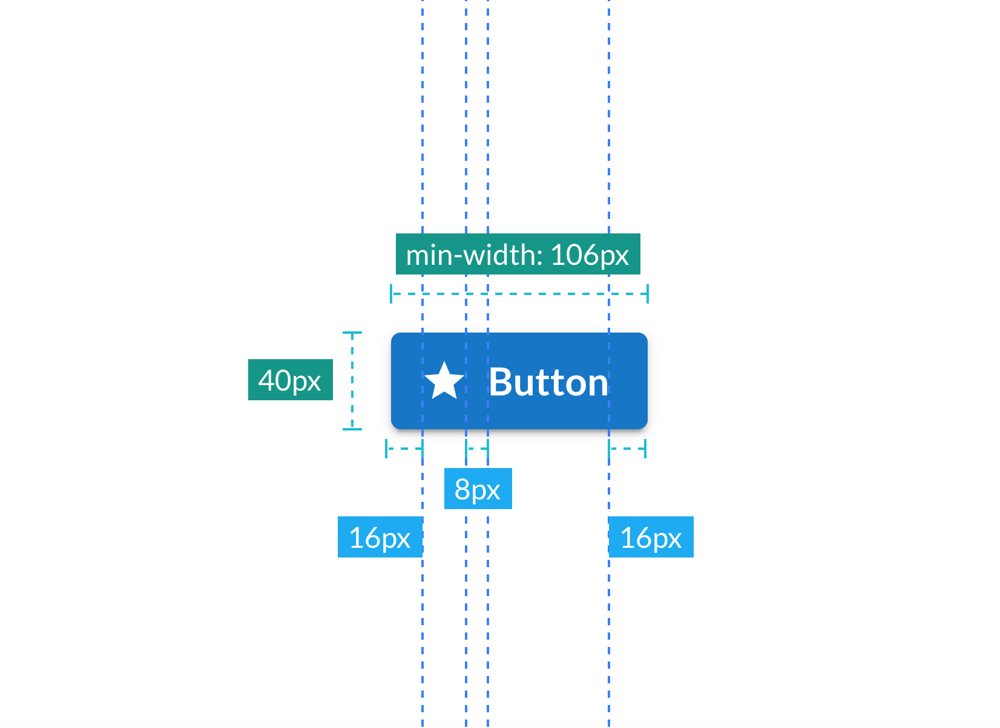

# Button

To ensure all Taylor Digital technologies are usable and functional, match the Taylor Digital approved style and variants for **Buttons** shown here.


_Taylor Digital uses the **Buttons** component guidelines defined by_ [_Google Material Design_](https://material.io/components/buttons/)_. Before building this component, read and adhere to the guidelines listed on that page._


## Usage 

Buttons communicate actions that users can take. They are typically placed throughout your UI, in places like:

* Dialogs
* Modal windows
* Forms
* Cards
* Toolbars

## Principles

Buttons are identifiable, findable, and specific.

**Identifiable:** Buttons should indicate that they can trigger an action.  
**Findable:** Buttons should be easy to find among other elements, including other buttons.  
**Clear:** A button’s action and state should be clear.

## Types


[View demo page](https://preview.uxpin.com/8c9bcf649cd5f0df18d4a69d9d7bfc9ce6d477ae#/pages/122177476/simulate/no-panels?mode=cvhidmf) to see the component states, interactions and detailed specifications.


### Primary Contained Button \(high emphasis\)







<table>
  <thead>
    <tr>
      <th style="text-align:left">Measurements</th>
      <th style="text-align:left">Text</th>
      <th style="text-align:left">Color</th>
      <th style="text-align:left">Shape and Elevation</th>
    </tr>
  </thead>
  <tbody>
    <tr>
      <td style="text-align:left">
        
Min-Width: <b>82px</b>
        

        
Height: <b>40px</b>
        

        
Padding: <b>16px</b>
        

      </td>
      <td style="text-align:left">
        
Font Family: <b>Lato</b>
        

        
Font Size: <b>16px</b>
        

        
Font Color: <b>#FFFFFF</b>
        

      </td>
      <td style="text-align:left">
        
Default: <b>#0A74C7</b>
        

        
Hover: <b>#004996</b>
        

      </td>
      <td style="text-align:left">Shape: Rounded: <b>4px</b>
         Elevation: <b>2dp</b>
      </td>
    </tr>
  </tbody>
</table>




### Primary Contained Button  w/ Icon \(high emphasis\)



_Coming Soon_



<table>
  <thead>
    <tr>
      <th style="text-align:left">Measurements</th>
      <th style="text-align:left">Text</th>
      <th style="text-align:left">Color</th>
      <th style="text-align:left">Shape and Elevation</th>
    </tr>
  </thead>
  <tbody>
    <tr>
      <td style="text-align:left">
        
Min-Width: 106<b>px</b>
        

        
Height: <b>40px</b>
        

        
Padding:
           <b>Outer</b>- <b>16px</b>
        

        
<b>Inner - 8px</b>
        

      </td>
      <td style="text-align:left">
        
Font Family: <b>Lato</b>
        

        
Font Size: <b>16px</b>
        

        
Font Color: <b>#FFFFFF</b>
        

      </td>
      <td style="text-align:left">
        
Default: <b>#0A74C7</b>
        

        
Hover: <b>#004996</b>
        

      </td>
      <td style="text-align:left">Shape: Rounded: <b>4px</b>
         Elevation: <b>2dp</b>
      </td>
    </tr>
  </tbody>
</table>




### Secondary Outlined Button \(medium emphasis\)







<table>
  <thead>
    <tr>
      <th style="text-align:left">Measurements</th>
      <th style="text-align:left">Text</th>
      <th style="text-align:left">Color</th>
      <th style="text-align:left">Shape &amp; Elevation</th>
    </tr>
  </thead>
  <tbody>
    <tr>
      <td style="text-align:left">
        
Min-Width: 82<b>px</b>
        

        
Height: <b>40px</b>
        

        
Padding: <b>16px</b>
        

      </td>
      <td style="text-align:left">
        
Font Family: <b>Lato</b>
        

        
Font Size: <b>16px</b>
        

        
Font Color: <b>#0A74C7</b>
        

      </td>
      <td style="text-align:left">
        
Default: <b>#FFFFFF</b>
        

        
Hover: <b>#0A75C7  </b>Opacity<b>: 4%</b>
        

      </td>
      <td style="text-align:left">Shape: Rounded: <b>4px</b>
         Elevation: <b>2dp</b>
      </td>
    </tr>
  </tbody>
</table>




### Secondary Outlined Button w/ Icon \(medium emphasis\)



_Coming Soon_



<table>
  <thead>
    <tr>
      <th style="text-align:left">Measurements</th>
      <th style="text-align:left">Text</th>
      <th style="text-align:left">Color</th>
      <th style="text-align:left">Shape &amp; Elevation</th>
    </tr>
  </thead>
  <tbody>
    <tr>
      <td style="text-align:left">
        
Min-Width: 106<b>px</b>
        

        
Height: <b>40px</b>
        

        
Padding:
           <b>Outer</b>- <b>16px</b>
        

        
<b>Inner - 8px</b>
        

      </td>
      <td style="text-align:left">
        
Font Family: <b>Lato</b>
        

        
Font Size: <b>16px</b>
        

        
Font Color: <b>#0A74C7</b>
        

      </td>
      <td style="text-align:left">
        
Default: <b>#FFFFFF</b>
        

        
Hover: <b>#0A75C7  </b>Opacity<b>: 4%</b>
        

      </td>
      <td style="text-align:left">Shape: Rounded: <b>4px</b>
         Elevation: <b>2dp</b>
      </td>
    </tr>
  </tbody>
</table>




### Tertiary Text Button \(low emphasis\)







<table>
  <thead>
    <tr>
      <th style="text-align:left">Measurements</th>
      <th style="text-align:left">Text</th>
      <th style="text-align:left">Color</th>
      <th style="text-align:left">Shape &amp; Elevation</th>
    </tr>
  </thead>
  <tbody>
    <tr>
      <td style="text-align:left">
        
Min-Width: 64<b>px</b>
        

        
Height: <b>40px</b>
        

        
Padding: <b>16px</b>
        

      </td>
      <td style="text-align:left">
        
Font Family: <b>Lato</b>
        

        
Font Size: <b>16px</b>
        

        
Font Color: <b>#0A74C7</b>
        

      </td>
      <td style="text-align:left">
        
Default: <b>#FFFFFF</b>
        

        
Hover: <b>#0A75C7  </b>Opacity<b>: 4%</b>
        

      </td>
      <td style="text-align:left">Shape: Rounded: <b>4px</b>
         Elevation: <b>2dp</b>
      </td>
    </tr>
    <tr>
      <td style="text-align:left"><b>Disabled Specs</b>
      </td>
      <td style="text-align:left">
        
Font Color: <b>#000000</b>
        

        
Opacity<b>: 26%</b>
        

      </td>
      <td style="text-align:left">
        
Border: <b>#000000</b>
        

        
Opacity: <b>12%</b>
        

      </td>
      <td style="text-align:left"></td>
    </tr>
  </tbody>
</table>




### Toggle Button



_Coming soon_







### 

